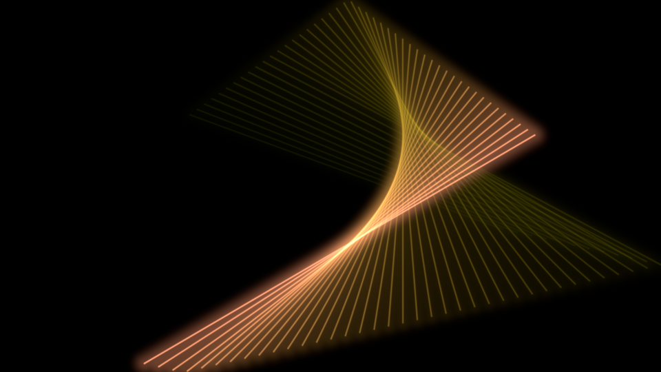
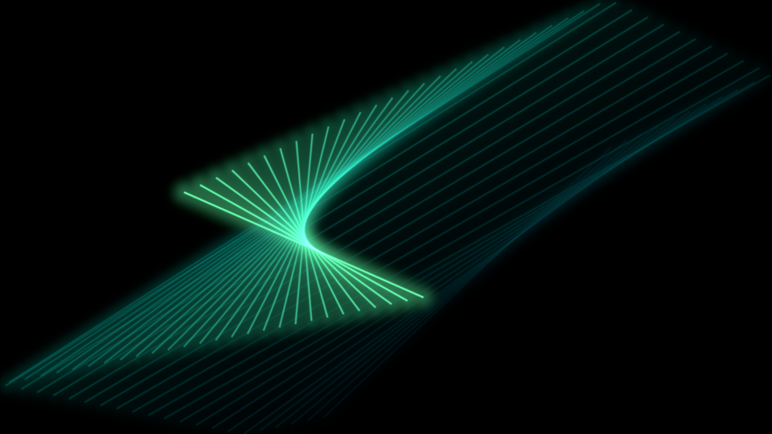
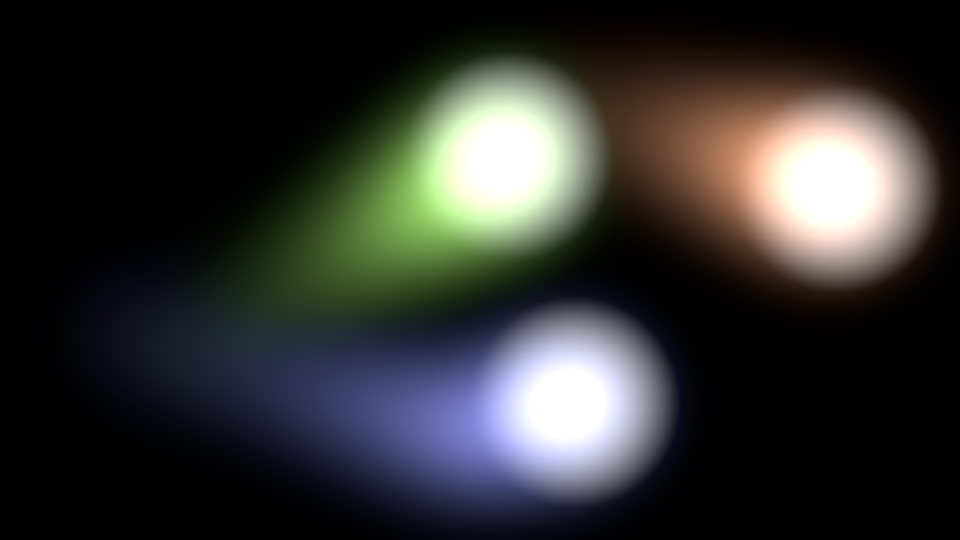
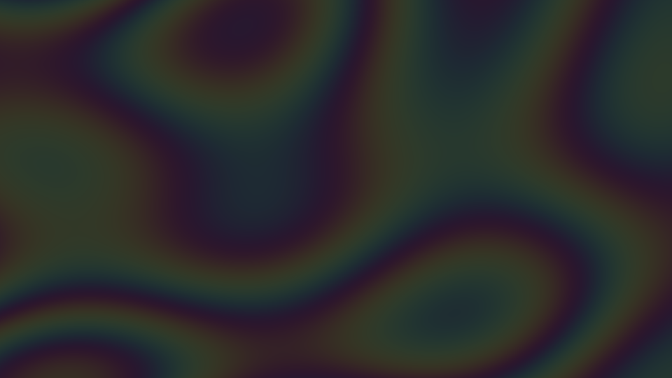
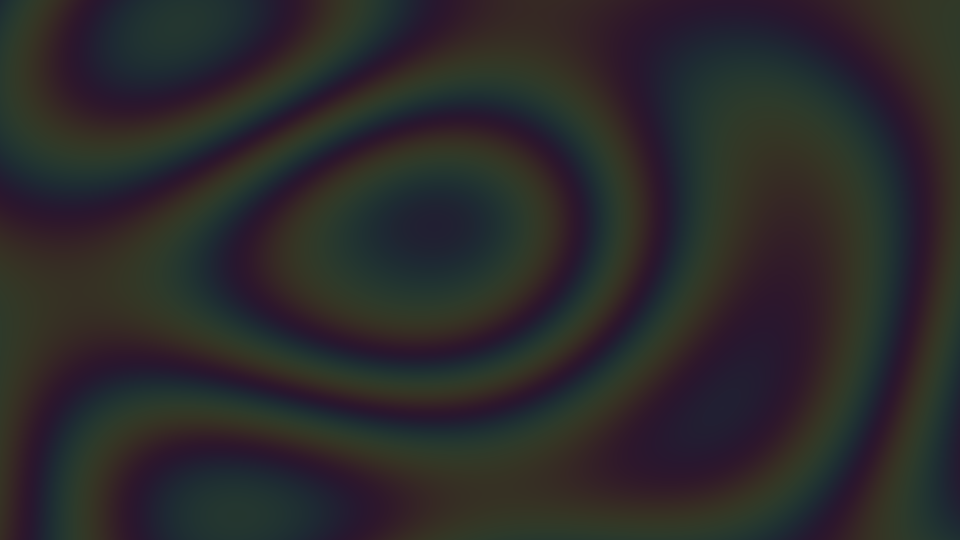

# scrnsav

A small Wayland screensaver for GNOME/Mutter, in Rust.

It runs a fullscreen WGSL fragment shader (Shadertoy-style) when the session goes
idle, and dismisses on any input. Two pieces, mirroring the classic
xscreensaver split of daemon vs. display hack:

- **`scrnsav watch [secs]`** — a daemon that asks Mutter's `IdleMonitor`
  (over D-Bus) to notify it after N seconds idle, then launches the saver. The
  idle-triggered saver dismisses on any input (key, mouse button, movement), so
  the returning user clears it however they touch the machine.
- **`scrnsav show`** — the fullscreen renderer, for previewing effects. Run
  directly it exits on **Escape only**, so a stray mouse bump won't close it.

## Why it works this way (and its limits on GNOME)

Wayland splits what X11's xscreensaver did in one process:

1. **Idle detection + locking** — owned by the compositor.
2. **The graphics** — just a fullscreen app.

On GNOME specifically:

- ❌ It **cannot replace the lock screen.** GNOME Shell implements neither
  `ext-session-lock-v1` nor layer-shell, so third-party lockers (swaylock etc.)
  don't work. `scrnsav` is a *visual* screensaver, not a locker.
- ✅ It **can** detect idle via `org.gnome.Mutter.IdleMonitor` and pop a normal
  fullscreen window.

If you want true lock integration later, that requires a GNOME Shell extension
(GJS/Clutter) — a different, GNOME-version-coupled project.

## Build & run

A `Makefile` wraps the common flows (`make help` lists them): `make build`,
`make run` (preview fullscreen now), `make watch IDLE=60`, `make install`
(systemd user service), `make uninstall`. The raw cargo commands:

```sh
cargo build --release

# Preview an effect right now (Esc to exit):
./target/release/scrnsav show

# List the bundled effects, then pick one by name:
./target/release/scrnsav list
./target/release/scrnsav show --shader plasma

# --shader also takes a path to your own .wgsl file:
./target/release/scrnsav show --shader ./my-effect.wgsl

# Run the idle daemon (fires after 300s; pass seconds to override).
# --shader is forwarded to each saver it launches:
./target/release/scrnsav watch 300
./target/release/scrnsav watch 60 --shader plasma
RUST_LOG=info ./target/release/scrnsav watch 60   # with logging
```

With `make`, pass `SHADER=`: `make run SHADER=shaders/plasma.wgsl`.

## Important: stop GNOME from blanking first

GNOME has its own idle screen-blank that will fight with (and usually beat) this.
Disable GNOME's blank so `scrnsav` is what you see on idle:

```sh
gsettings set org.gnome.desktop.session idle-delay 0   # 0 = never blank
```

(Set `scrnsav watch` to a shorter timeout than any remaining GNOME dim/suspend.)

## Autostart as a user service

Install the unit, then enable it:

```sh
mkdir -p ~/.config/systemd/user
cp scrnsav.service ~/.config/systemd/user/
# edit the ExecStart path in the unit if your checkout isn't ~/Code/randomibis/scrnsav
systemctl --user daemon-reload
systemctl --user enable --now scrnsav.service
```

## Writing new effects

Effects live in `shaders/` as WGSL and are compiled into the binary, so you can
select them by bare name with `--shader NAME` (see `scrnsav list`). Three are
bundled:

- `lines` — the default: a retro vector line strung between two bouncing points,
  trailing a colour-cycling ribbon.
- `plasma` — classic plasma; run it with `--shader plasma`.
- `balls` — retro bouncing balls with a phosphor afterimage trail; run it with
  `--shader balls`.

The fragment shader gets a uniform:

```wgsl
struct Uniforms { time: f32, seed: f32, resolution: vec2<f32>, };
```

`frag.xy / u.resolution` gives normalized coordinates; `u.time` is seconds since
launch; `u.seed` is a per-monitor phase offset (so multi-monitor setups show a
different variation on each screen — fold it into your math to make use of it).

To use your own effect, write a `.wgsl` file with `vs_main`/`fs_main` entry
points (copy `plasma.wgsl` as a starting point) and pass its path with
`--shader PATH` — no rebuild needed. A bundled name always wins over a file of
the same bare name, so use a path (e.g. `./plasma.wgsl`) to run a local copy.
The bundled effects are compiled in, so `scrnsav show` always works with no
arguments.

Run `make test` (or `cargo test`) to validate every shader in `shaders/` — it
parses and validates them with naga (the same compiler wgpu uses), catching
errors without launching the GUI.

## Shaders

The three built in shaders are `lines` (the default), `balls`, and `plasma`:

### lines



### balls



### plasma



Regenerate these with `make shots` (renders each shader to `docs/shots/`).
